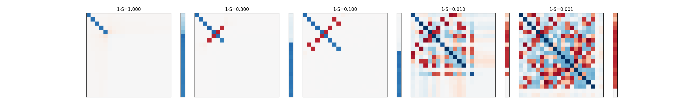
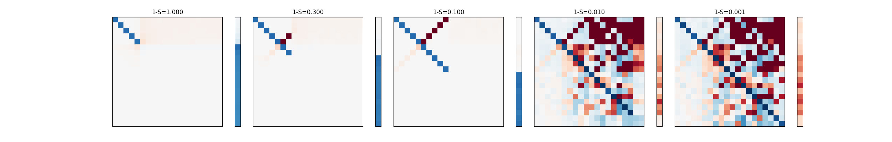

# INSTALL
```
pyenv install 3.8.10
python -m venv venv
source venv/bin/activate
pip install -r requirements.txt
```

# Toy Models for Superposition
This is a replication of the results from: 
https://transformer-circuits.pub/2022/toy_model/index.html

# Summary
## Superposition
  
Question:  
Given a simple AI model:  
1.  y = decoder(encoder(x))  
so that y = x  
  
2. where the encode will reduce the dimension of the features from:  
num_of_feat to num_of_middle   
  
3. the decoder will reverse from:  
num_of_middle to num_of_feat

4. num_of_feat > num_of_middle  

Under what conditions will the AI be able to predict y = x
which means it can learn more features then the num_of_middle neurons? 
Thus achieving Superposition of features onto middle neurons?  
  
Answer: 
When the following two conditions are met:  
1. features are sparse,  
2. and RELU cut off is used  
  
The next section will explain the setup to test the above results.  
  
## Setup
Build a network that outputs same feature vectors as inputs:  
y = f(x)  
x = (num_of_data_points, num_of_feat)  
y = (num_of_data_points, num_of_feat)  

Two networks are tested:  
src/superposition/toynet.py  
  
1. One Weight Linear Net  
  
    y = RELU(x * w1 * w1.T + b)  
    
    num_of_feat = 20  
    num_of_middle = 5  
  
    encoder: w1.shape = (num_of_feat, num_of_middle)  
    decoder: w1.T.shape = (num_of_middle, num_of_feat)  
             b.shape = (num_of_feat, )  
  
constrained the decoder to use transposed of w1  
  
2. Two Weights Linear Net     
  
    y = RELU(x * w1 * w2 + b)  
  
    num_of_feat = 20  
    num_of_middle = 5  
  
    encoder: w1.shape = (num_of_feat, num_of_middle)  
    decoder: w2.shape = (num_of_middle, num_of_feat)  
             b.shape = (num_of_feat, )

The network is trained using different sparsity levels:  
[0, 0.7, 0.9, 0.99, 0.999]  
0 = 100% of the the time a features appears  
0.7 = only 30% of the time a feature appears  
  
## Results
For the One Weight Linear Net, it is expected the multiplication of w1 and w1.T  
will be an identity matrix as the training is aiming for arg min mse =  (y - x) ^ 2 , input = output  

Similarly for the second model, Two Weight Linear Net, the multiplication of w1 and w2  
should also be an identity matrix

If we count the diagonals of the multiplication of w1 and w1.T, we can know how many features were learned.
So we will visualize the middle matrices for both models and their bias term b.  
  
1. One Weight Linear Net:  
each square box = w1 * w1.T = (num_of_feat, num_of_middle) * (num_of_middle, num_of_feat) = (num_of_feat, num_of_feat)  
each column = bias vector = bias = (num_of_feat,)   
accross different sparsity levels: 1-S = 0.1 means only 10% of the features appear at a time.  
White = Zero value, 0  
Blue = positive value  
Red = negative value  
  
  
  
On the left, when data is not sparse and all features appear, the network only learned the identity matrix   
where the middle 4 diagonals are all blue. This means only 4 out of 20 input features where learned as the rest of the matrices are white(empty).  
The bias is positive for the 16 features that are not learned. 
For these 16 features, the network always predicts they exist eventhough they may not.  
  
Going towards the right, sparsity increases to 99.9%, the matrices become more red. This represents some superposition.  
The bias also becomes negative to offset some correlated features.  
  
The right most chart learns almost 18 out of 20 input features when sparsity is 0.001.  

2. Two Weight Linear Net:  
each square box = w1 * w2 = (num_of_feat, num_of_middle) * (num_of_middle, num_of_feat) = (num_of_feat, num_of_feat)  
each column = bias vector = bias = (num_of_feat,)   
accross different sparsity levels: 1-S = 0.1 means only 10% of the features appear at a time.  
White = Zero value, 0  
Blue = positive value 1.3  
Red = negative value -1.3  
  
  
  
The main difference between the Two Weight Linear Net and the transposed One Weight Linear Net is that the red values  
cluster towards the upper diagonal when sparsity increases from left to right.  
  
The right most chart learns all of the 20 input features when sparsity is 0.001.  
  
# Conclusion

This repo shows that if two conditions:   
1. features are sparse,  
2. and RELU cut off is used  
  
The neural network will entangle these features  
such that when one feature is detected,   
it will cause a set of entangled features to also be detected.  

The activation function will cut off the weaker features  
and only allow few strong features to pass through.  
Here feature strength is measured by the magnitude of the vector.  

Normally, without 2 conditions above, in an 2D XY space, you can represent:  
at most 4 features in the direction positive X, negative X, positive Y and negative Y directions  
Thus the neural network can only learn 4 features which are 90 degrees apart  
and thus only learns Top-4 weighted features from data  

But when Superposition happens, the neural network will  
arrange vector features into a windmill structure like roots of unity,  
squeezing 5 features(2pi/5 angle) or 8 features(2pi/8)  
onto 2d the XY space.  
  
So when a feature is detected, since the vector features are not 90 degrees(orthogonal)  
another correlated features at the side will also fire  
but since the features are sparse, it is unlikely that both fired at the same time in reality  
the RELU will cut it off which allows the network to squeeze more features  
resulting in angles between features to be < 90 degrees (non independent)  
 
