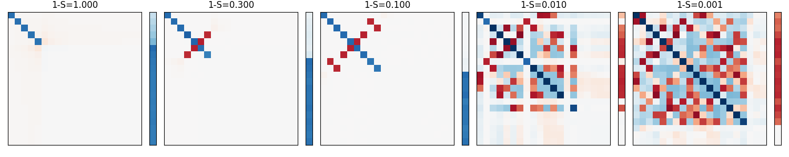
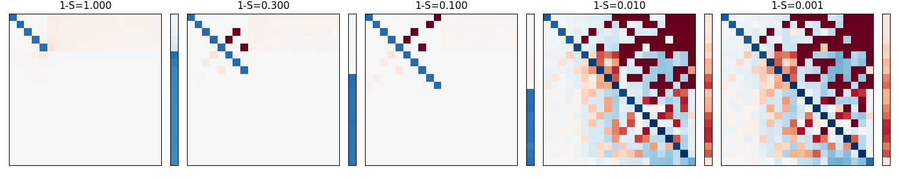
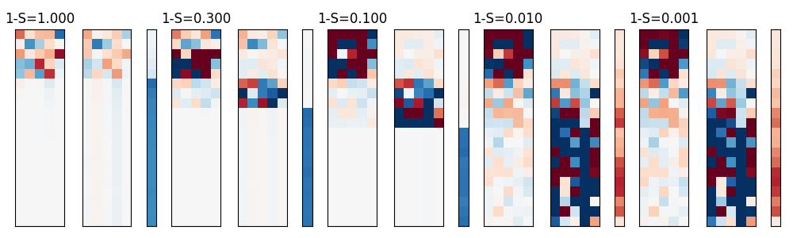

# Toy Models for Superposition
This repo PARTIALLY replicates some important results from:  
https://transformer-circuits.pub/2022/toy_model/index.html  

TLDR;  
The repo focus on a understaning how a simple linear encoder/decoder model compress data into the network when data has more dimensions then the output of the encoder.  
When three conditions: sparse data, weighted data when calculating loss, and non-linear activation like RELU are fulfilled, the network can squeeze high dimensional data into the encoder.

Further, I make an observation that tenary encoding maybe happening in the encoder/decoder model, instead of just binary encoding.  

To install and train : see 

# Superposition
  
Question:  
Given a simple AI model:  
1.  y = decoder(encoder(x))  
so that loss = mse_loss(y, x)  
we want this model to predict the identity matrix that maps x to y
   
2. where the encode will reduce the dimension of the features from:  
num_of_feat to num_of_middle   
  
3. the decoder will reverse from:  
num_of_middle to num_of_feat

4. num_of_feat > num_of_middle  

Under what conditions will the AI be able to map x to y like the identity matrix  
which means it can learn more features then the num_of_middle neurons? 
Thus achieving Superposition of features onto middle neurons?  
  
Answer: 
When the following conditions are met:  
1. features are sparse,  
2. features are weighted in the loss function,
3. and RELU cut off is used  
  
The next section will explain the setup to test the above results.  
  
## Setup
1. Build two network that outputs same feature vectors as inputs:  
y = f(x)  
x = (num_of_data_points, num_of_feat) = randomly generated and normalized to unit vector  
y = (num_of_data_points, num_of_feat)  

2. minimize weighted_mse_loss = weight * mse_loss(x, y) 
using Adam optimizer with learning rate 0.001, and weight decay 0.01.  
  
3. vary the sparsity of the data and plot the results.  

see  on how data is generated.  
see  on two models tested.  

To install and train : see 

 
## AI Networks
  
1. One Weight Linear Net  
  
    y = RELU(x * w1 * w1.T + b)  
    
    num_of_feat = 20  
    num_of_middle = 5  
  
    encoder: w1.shape = (num_of_feat, num_of_middle)  
    decoder: w1.T.shape = (num_of_middle, num_of_feat)  
             b.shape = (num_of_feat, )  
  
constrained the decoder to use transposed of w1  
  
2. Two Weights Linear Net     
  
    y = RELU(x * w1 * w2 + b)  
  
    num_of_feat = 20  
    num_of_middle = 5  
  
    encoder: w1.shape = (num_of_feat, num_of_middle)  
    decoder: w2.shape = (num_of_middle, num_of_feat)  
             b.shape = (num_of_feat, )

The network is trained using different sparsity levels:  
sparsity_list = [0, 0.7, 0.9, 0.99, 0.999]  
0 = 100% of the the time a features appears  
0.7 = only 30% of the time a feature appears  
  
Both models were trained till MSE loss converged.  

## Results
For the One Weight Linear Net, it is expected the multiplication of w1 and w1.T  
will be an identity matrix as the training is aiming for arg min mse = mean (y - x) ^ 2 , where input x = output y.  

Similarly for the second model, Two Weight Linear Net, the multiplication of w1 and w2 should also be an identity matrix.  

If we count the diagonals of the multiplication of w1 and w1.T, we can know how many features were learned.
So we will visualize the square matrices = w1 * w1.T and w1 * w2  and their respective bias term b.  
  
1. One Weight Linear Net:  
each square box = w1 * w1.T = (num_of_feat, num_of_middle) * (num_of_middle, num_of_feat) = (num_of_feat, num_of_feat)  
each column = bias vector = bias = (num_of_feat,)   
accross different sparsity levels: 1-S = 0.1 means only 10% of the features appear at a time.  
White = Zero value, 0  
Blue = positive value  
Red = negative value  
  
  
  
On the left, when data is not sparse and all features appear, the network only learned the identity matrix where the middle 5 diagonals are all blue. 
This means only 5 out of 20 input features where learned as the rest of the matrices are white(empty). 
  
The bias is positive for the 15 features that are not learned. 
For these 15 features, the network always predicts they exist via the positive bias even though they may not.  
  
Going towards the right, sparsity increases to 99.9%, the matrices become more red.   
  
Note: Each row of the square represent one input features, and the columns of each row are the output features.  
So if input x has feature on the first row, it also fires up other features along the columns of the row.  
This represents some Superposition as the network is using num_of_middle neurons = 5 to try to represent more than 5 features.
  
The bias also becomes negative to offset some correlated features.  
  
The right most chart learns almost 18 out of 20 input features when sparsity is 0.001.  

2. Two Weight Linear Net:  
each square box = w1 * w2 = (num_of_feat, num_of_middle) * (num_of_middle, num_of_feat) = (num_of_feat, num_of_feat)  
each column = bias vector = bias = (num_of_feat,)   
accross different sparsity levels: 1-S = 0.1 means only 10% of the features appear at a time.  
White = Zero value, 0  
Blue = positive value 1.3  
Red = negative value -1.3  
  
  
  
The main difference between the Two Weight Linear Net and the transposed One Weight Linear Net is that the red values cluster towards the upper diagonal when sparsity increases from left to right.  
The right most chart learns all of the 20 input features when sparsity is 0.01.  

# Postulate
Here we depart from replicating the paper and make some original observations.

How can 5 neurons represent 20 features?
if we use binary encoding, we can have 2 ^ 5 values if we have 5 slots.  
This is 32 slots for 20 features.  
  
Superposition may be representing 32 features in some mixture of binary encoding and normal encoding where 1 neuron slot = 1 features.  

Comparing the weight values of OneWeightLinearNet and TwoWeightLinearNet:
## One Weight Linear Net Weight and Biases
  

## Two Weight Linear Net Weight and Biases
  
Within one sparsity block 
left matrix = w1  
mid matrix =  w2.T  
right vector = bias  

As we go right, observe that the w1 and w2 split up their roles. w1 focus on learning the first 5 most heavily weighted features. While w2 learns the remaining features.  
This results in the w1 @ w2 identity matrix to be filling up the upper diagonal while leaving the bottom diagonal empty(zero values).  
  
It is possible that tenary encoding is happening. 
Values close to 0 are used to splits up the features to be represented between w1 and w2.  

One a feature is in w1, the values are strongly positive or negative.  
Similarly, once a feature is in w2, the values are strongly positive or negative.   

The tenary encoding may not be strictly 1, -1, 0 but rather strongly positive, strongly negative or close to zero.